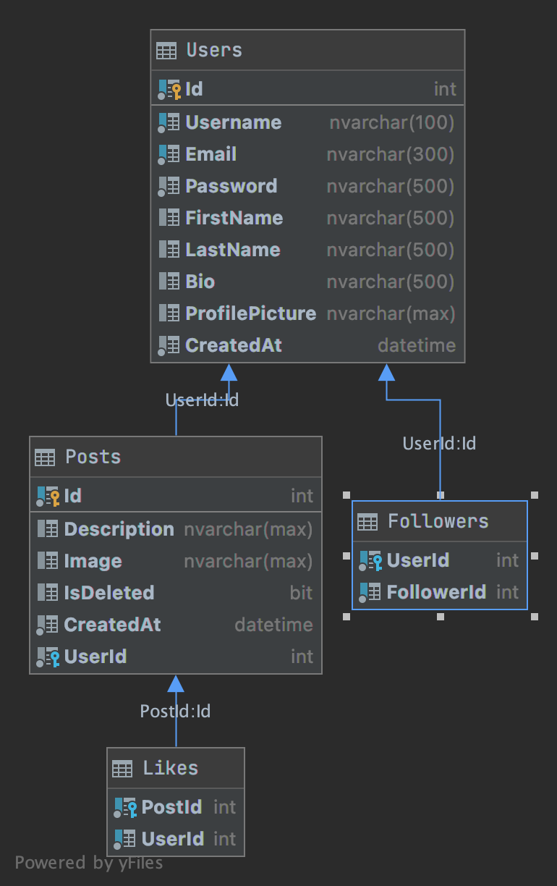

# Gocial
> Gocial is a simple backend service for social apps.

## Features

 1. create user
 2. update user info
 3. update user pp
 4. update user password
 5. get user detail
 6. follow user
 7. unfollow user
 8. get user follows
 9. get user followers
 10. create post
 11. get user's posts
 12. get posts (newsfeed)
 13. get post detail
 14. delete the post
 15. like the post
 16. unlike the post

## DB Schema

> todo : auth guard 
